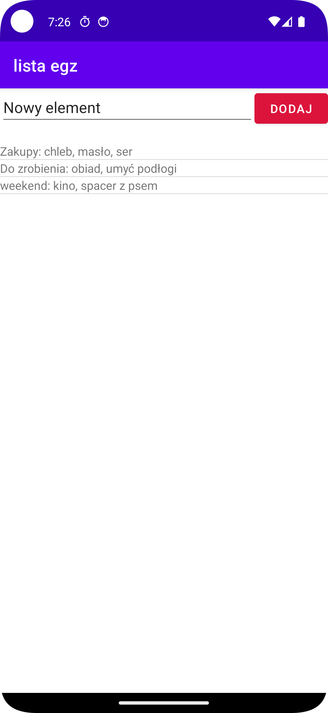
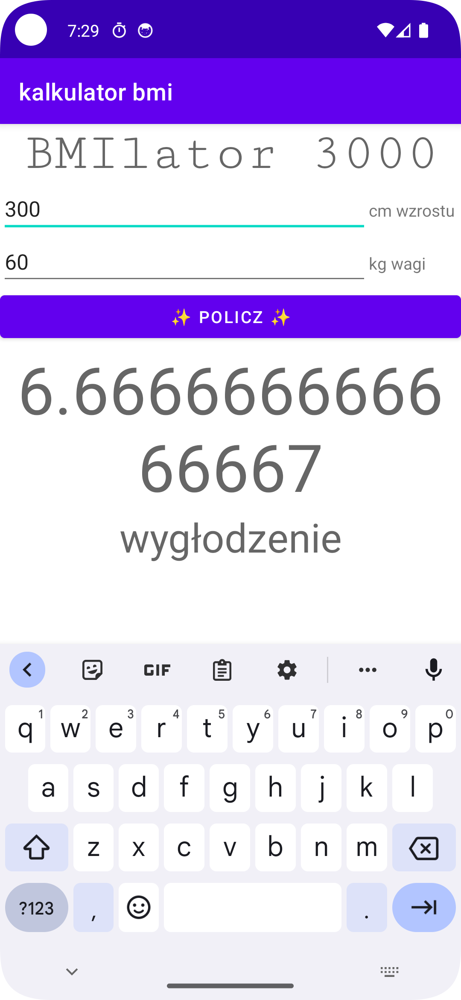
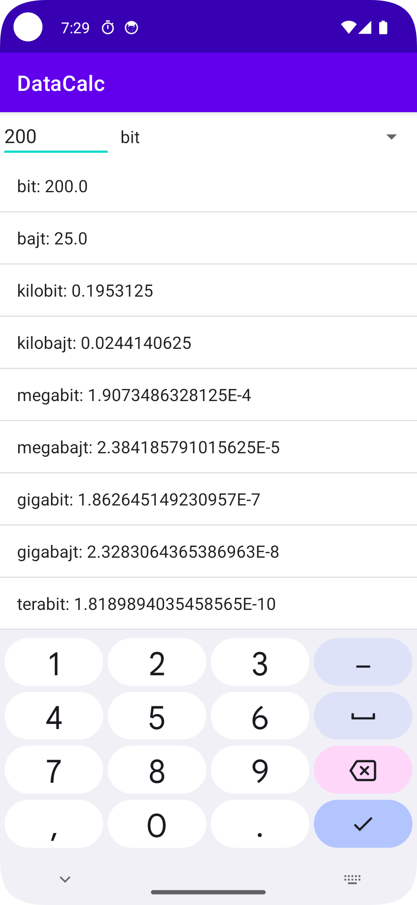
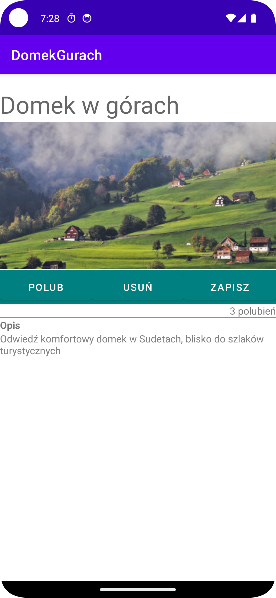
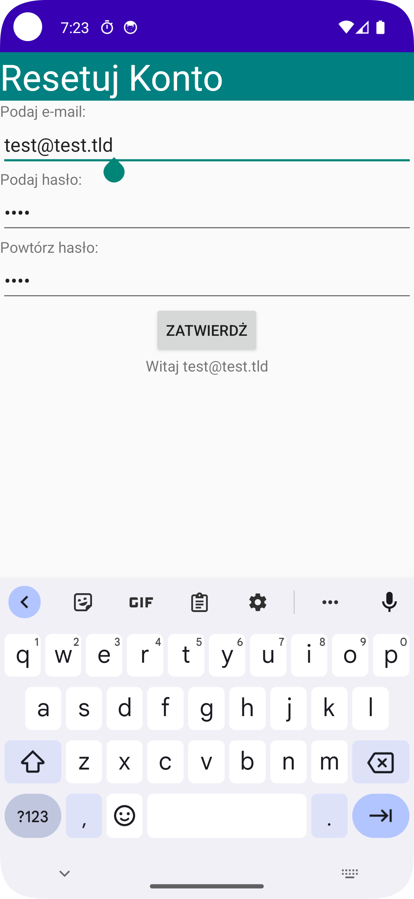

# android-java-homework

This repository contains various homework applications developed during my time in highschool.

# inboxProject
`/inboxProject`
Simple markdown editor and notes manager with tags and image support.

# todolistex
`/todolistex`
A simple To-Do list application with persistance.

# PracownikGenerator
`/PracownikGenerator`
A tool that generates passwods based on rules. Made with verbose java.

# DataCalc
`/DataCalc`
This application allows users to easily convert units of data storage.

# DomekGurach
`/DomekGurach`
This is an app with a like simple counter.

# kalkulatorbmr
`/kalkulatorbmr`
An app to calculate Basal Metabolic Rate (BMR).

# listaegz
`/listaegz`
A simple To-Do list application.

# logowanko
`/logowanko`
An app for that validates passwords and emails.

# Szyfr
`/szyfr`
A simple console app for a substitution cipher.
